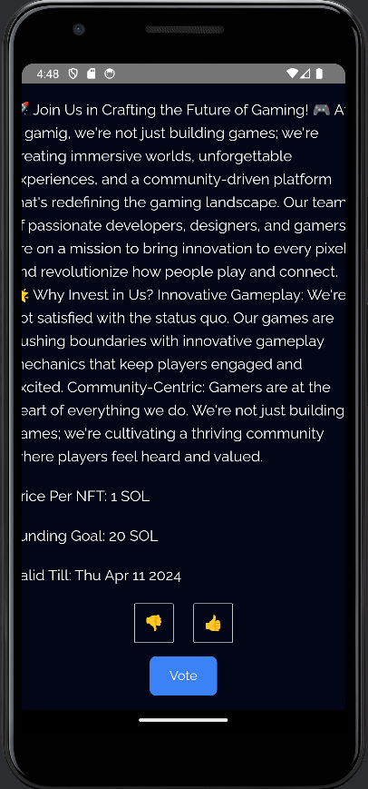

# DreamStarter: The Future of Crowdfunding on Blockchain for Events and Startups

## Table of Contents
- [Introduction](#introduction)
- [The Problem](#the-problem)
- [The Solution](#the-solution)
- [Key Features](#key-features)
    - [Wide-Ranging Project Support](#wide-ranging-project-support)
    - [Proposal and Voting System](#proposal-and-voting-system)
    - [NFT-Driven Funding and Rewards](#nft-driven-funding-and-rewards)
    - [Comprehensive Staking and Accountability Framework](#comprehensive-staking-and-accountability-framework)
    - [Transparent and Secure Financial Operations](#transparent-and-secure-financial-operations)
    - [Empowering Community Governance](#empowering-community-governance)
    - [Inclusive Community Building and Engagement](#inclusive-community-building-and-engagement)
    - [Profit Sharing and Incentivization](#profit-sharing-and-incentivization)
    - [Adaptive Project Evaluation](#adaptive-project-evaluation)
- [DreamStarter Technical Architecture](#dreamstarter-technical-architecture)
  - [Frontend Technology Stack](#frontend-technology-stack)
  - [Smart Contracts](#smart-contracts)
    - [NFT Contract](#nft-contract)
    - [Stake Contract](#stake-contract)
    - [Interaction with the Sui Blockchain](#interaction-with-the-sui-blockchain)
  - [App Technology Stack](#app-technology-stack)
- [How To Use It](#how-to-use-it)
- [Demo](#demo)

 

## Introduction
Overview:

DreamStarter revolutionizes the crowdfunding landscape, extending beyond the realms of traditional event organization to embrace a wide spectrum of initiatives, from groundbreaking physical and digital events to innovative startups, gaming ventures, comics, and company launches. Powered by the Sui blockchain, this platform forges a direct connection between Contributors and Idea Creators (Event Organizers and Startup Visionaries), facilitating the birth of event ideas and pioneering projects. By integrating the stability and transparency of blockchain with the dynamism of NFTs and stablecoins, DreamStarter empowers communities to transform imaginative concepts into reality, ensuring every project not only starts strong but also has a community to support its growth.

## The Problem
Navigating the traditional crowdfunding realm can be fraught with challenges: opaque financial management, uncertain community engagement, and limited support for diverse projects. For creators, whether they’re planning an immersive concert or launching a gaming startup, these barriers can dampen innovation and hinder the realization of their visions.

## The Solution
DreamStarter reimagines crowdfunding with a blockchain backbone, supporting a vast array of projects from entertainment events to startup ventures. It democratizes the funding process, offering transparent financial tracking, community-driven governance, and innovative funding mechanisms through NFTs. This approach not only guarantees transparency and security but also cultivates a vibrant community around each project, ensuring a dedicated user base and sustainable growth.

## Key Features

### Wide-Ranging Project Support
DreamStarter is a platform that caters to a wide range of proposals, including sports events, concerts, pool parties, DJ events, gaming startups, corporate launches, and more. It is the go-to place for anyone with an idea who needs funding and who wants to build a community to support their business. It can be launched by Indivuals or Organizations Both.

### Proposal and Voting System
A gateway for individuals to pitch ideas or organizations to submit diverse project ideas. Three types of voting will then take place: 1. Specified Users 2. Everyone using the application 3. Dependent on location. If it received a sufficient number of votes, say 51%, they may move on to the next round, which is to start their own smart contracts for fundraising

### NFT-Driven Funding and Rewards
Unique utilization of NFTs for funding, offering DreamStarter Holder and DreamStarter Collab options, providing contributors with tangible benefits and a stake in the project’s success.

### Comprehensive Staking and Accountability Framework
Creators stake a portion of the funding goal, ensuring alignment with community interests and project success, fostering a trust-based ecosystem.

### Transparent and Secure Financial Operations
Leveraging blockchain for a clear, auditable trail of financial transactions, ensuring integrity and building trust among all participants.

### Empowering Community Governance
Incorporating DAOs for pivotal decision-making, DreamStarter places governance in the hands of its community, promoting democratic engagement and project alignment with user interests.

### Inclusive Community Building and Engagement
Not just a funding platform, DreamStarter nurtures a supportive ecosystem around projects, ensuring a robust and engaged user base from the outset.

### Profit Sharing and Incentivization
With DreamStarter Holder NFTs, contributors partake in the economic success of events and startups, aligning community and creator interests for mutual benefit.

### Adaptive Project Evaluation
A structured evaluation process post-launch assesses project outcomes, reinforcing accountability and trust, and paving the way for future collaborations.

# DreamStarter Technical Architecture

## Frontend Technology Stack:

- **Next.js**: A React framework that enables functionality such as server-side rendering and generating static websites for React-based web applications.
- **Tailwind CSS**: A utility-first CSS framework for rapidly building custom designs.
- **zk-Login for Authentication**: Allows users to connect to the dApp without already having a Sui wallet, enhancing accessibility and user experience.

### Website Screenshot

## Smart Contracts

### NFT Contract

- Manages the minting, trading, and ownership of NFT tickets.
- Governs the creation of DreamStarter Holder and Collab NFTs, ensuring their uniqueness and linking them to specific events or projects.

### Stake Contract

- Facilitates the staking mechanism for event organizers, including the locking of funds as a commitment to project success.
- Handles the distribution of profits back to NFT holders.
- Manages the refund process in case an event does not meet its crowdfunding goal.

### Interaction with the Sui Blockchain

- Deployed on the Sui blockchain, benefiting from its high throughput and low transaction costs.
- The contracts interact with the blockchain to record transactions, manage NFTs, and ensure the integrity of the crowdfunding process.
- Leverages Sui's capabilities for scalability and security.

## App Technology Stack:

- **Android SDK and Java**: Utilized for the mobile app development to ensure robust performance and compatibility across a wide range of Android devices.
- Ensures that users have reliable access to DreamStarter’s features anytime, anywhere.

# How To Use It

### App Screenshot

### Step 1: Connect Your Wallet
**Description:** Begin by connecting your digital wallet to DreamStarter. If you don't have one, use zkLogin for enhanced privacy and security.

### Step 2: Create Proposals/Ideas
**Description:** Navigate to the Launch section and submit your project proposal. Detail your project and specify the voting timeframe to gather community support.

### Step 3: Vote on Ongoing Proposals
**Description:** Explore the Ongoing Proposals under the Explore section. Vote on projects you believe in to help them reach the crowdfunding stage.

### Step 4: Convert Proposals to Crowdfunding Events
**Description:** If your proposal gathers enough votes, you can initiate the crowdfunding phase. Define the fundraising period and the NFT collection for your project.

### Step 5: Stake for Your Event
**Description:** As an event organizer, secure your project by staking a percentage of the fundraising goal. This step ensures commitment and builds trust with contributors.

### Step 6: Support Events by Minting NFTs
**Description:** Participate in crowdfunding events by minting NFTs. Your contribution helps bring the project to life, and you receive unique NFTs in return.

### My Crowdfunding Event NFTs
**Description:** Track and manage your NFTs from supported crowdfunding events. View your collection and any associated benefits or rewards.

### My Started Events
**Description:** Monitor the progress of events you’ve initiated. This section provides insights into funding status, participant engagement, and next steps.

## Important Time Limits
- **Creating Proposals/Ideas:** Remember, voting on proposals is only available within the designated timeframe set during submission.
- **Crowdfunding Events:** Contributions through NFT purchases must be made within the event’s specific crowdfunding window to count towards the project's goal.

### Demo
- **Link to a Live Demo:** [DreamStarter Live Demo](https://dream-starter-ashen.vercel.app/)