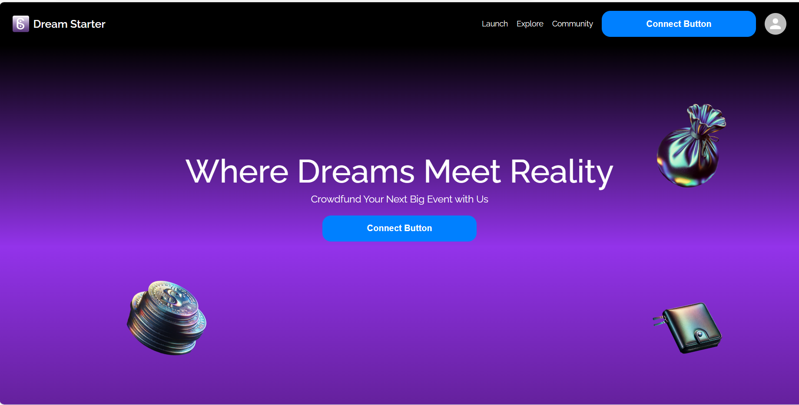
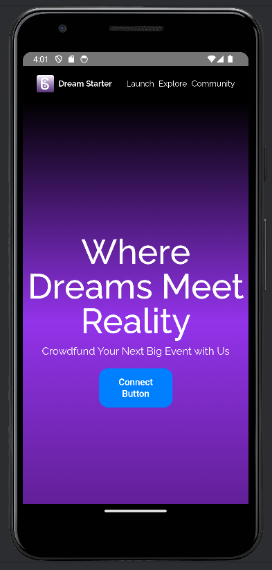
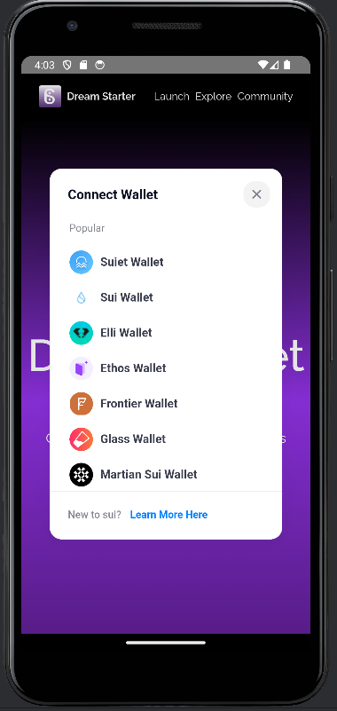
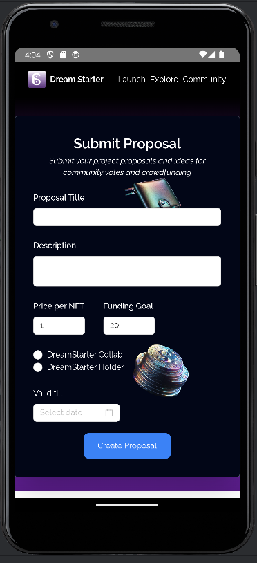
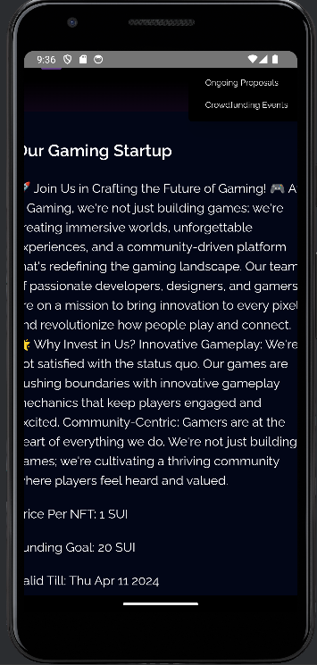
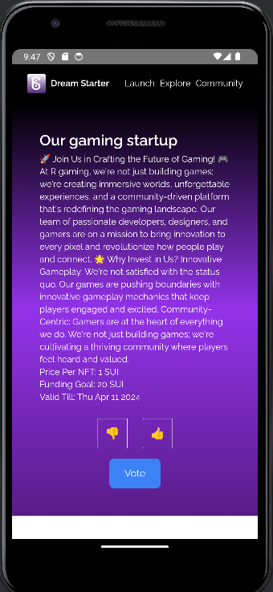
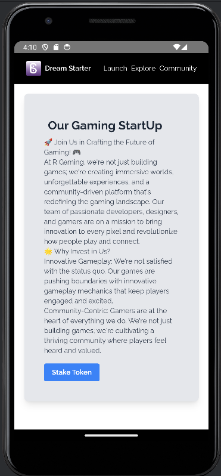
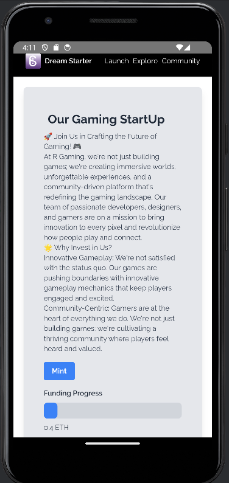

# DreamStarter: The Future of Crowdfunding on Blockchain for Events and Startups

## Table of Contents
- [Introduction](#introduction)
- [Overview](#overview)
- [The Problem](#the-problem)
- [The Solution](#the-solution)
- [Key Features](#key-features)
- [DreamStarter Technical Architecture](#dreamstarter-technical-architecture)
  - [Frontend Technology Stack](#frontend-technology-stack)
  - [Smart Contracts](#smart-contracts)
    - [NFT Contract](#nft-contract)
    - [Stake Contract](#stake-contract)
    - [Interaction with the Sui Blockchain](#interaction-with-the-sui-blockchain)
  - [App Technology Stack](#app-technology-stack)
- [How To Use It](#how-to-use-it)
- [Demo](#demo)
- [DreamStarter Roadmap: Future Development Plans](#dreamstarter-roadmap-future-development-plans)
 

## Introduction

DreamStarter revolutionizes the crowdfunding landscape, extending beyond the realms of traditional event organization to embrace a wide spectrum of initiatives, from groundbreaking physical and digital events to innovative startups, gaming ventures, comics, and company launches. Powered by the Sui blockchain, this platform forges a direct connection between Contributors and Idea Creators (Event Organizers and Startup Visionaries), facilitating the birth of event ideas and pioneering projects. By integrating the stability and transparency of blockchain with the dynamism of NFTs and stablecoins, DreamStarter empowers communities to transform imaginative concepts into reality, ensuring every project not only starts strong but also has a community to support its growth.

**Roles:**

1. **Proposal Creators** : Individuals or entities responsible for creating and managing events on the platform.
2. **Contributors (Product Users)**: Individuals interested in contributing to events by purchasing NFTs representing their contributions.

- In DreamStarter there are two types of NFT’s : -
    1. **DreamStarter Collab** : - This  NFTs provide contributors with additional benefits returns for supporting projects/ideas and  DreamStarter Holder NFTs will surpass traditional bank interest rates, because it is offering profits in a short period 
    2. **DreamStarter Holde**r : - It signify a regular contribution or ticket purchase,  donation for a idea with no financial returns 
- In the crowdfunding process, proposal creators are required to stake up to 20% of the crowdfunding goal. However, this staking requirement is significantly more advantageous than seeking a loan from a bank, as it entails a lower down payment and fosters a more collaborative funding model.
- Contributors will get Proof of Attendance Tokens (POAPs) as a gesture of appreciation once events, regardless of NFT type, have finished and through which community creation can be done. For a startup venture, contributors may also gain early access to products or services.

WIN WIN FOR ALL

## Overview 

### Proposal Submission:
- **Login & Create:** Users log in and submit a detailed proposal for an event, including duration for voting and the crowdfunding goal.
- **Community Voting:** Proposals are open for community voting for the specified duration. Proposals meeting the required vote threshold proceed to crowdfunding.

### Crowdfunding Phase:
- **Funding Goals:** If the proposal is approved, it moves to the crowdfunding phase where users can contribute funds.
- **Goal Achievement:** If the crowdfunding goal is reached within the set timeframe, the project moves forward. If not, contributions are refunded.

### Project Execution:
- **Initial Funding Access:** Post successful crowdfunding, the project initiator accesses the first milestone funds up to the staked amount without needing an expense report.
- **Expense Reporting:** For subsequent withdrawals, an expense report is necessary. This triggers the dispute period.

### Dispute Resolution:
- **Validation Period:** A one-week dispute period allows contributors to review and contest the expense reports.
- **Community Decision:** Discrepancies lead to a community vote. If the community votes against the expenses, the initiator loses the staked amount. If approved, the project continues.

### Project Conclusion:
- **Feedback & Review:** After the event, participants provide feedback, influencing the initiator’s future proposals and reputation on the platform.### Project Conclusion:
- **Feedback & Review:** After the event, participants provide feedback, influencing the initiator’s future proposals and reputation on the platform.

### Cycle Repeat or Exit:
- **New Proposals:** Satisfied organizers may propose new events, using their success and feedback as leverage for future projects.

## The Problem
Navigating the traditional crowdfunding realm can be fraught with challenges: opaque financial management, uncertain community engagement, and limited support for diverse projects. For creators, whether they’re planning an immersive concert or launching a gaming startup, these barriers can dampen innovation and hinder the realization of their visions.

## The Solution
DreamStarter reimagines crowdfunding with a blockchain backbone, supporting a vast array of projects from entertainment events to startup ventures. It democratizes the funding process, offering transparent financial tracking, community-driven governance, and innovative funding mechanisms through NFTs. This approach not only guarantees transparency and security but also cultivates a vibrant community around each project, ensuring a dedicated user base and sustainable growth.

## Key Features

- **Crowdfund any Idea**: DreamStarter caters to a wide range of proposals, including sports events, concerts, pool parties, DJ events, gaming startups, corporate launches, and more. It is the go-to place for anyone with an idea who needs funding and who wants to build a community to support their business. It can be launched by individuals or organizations.

- **Proposal and Voting System**: A gateway for individuals to pitch ideas or organizations to submit diverse project ideas. Three types of voting will then take place: 
  1. Specified Users 
  2. Everyone using the application 
  3. Dependent on location. If it received a sufficient number of votes, say 51%, they may move on to the next round, which is to start their own smart contracts for fundraising.

- **NFT-Driven Funding and Rewards**: Unique utilization of NFTs for funding, offering DreamStarter Holder and DreamStarter Collab options, providing contributors with tangible benefits and a stake in the project’s success.

- **Enhanced Trust and Accountability**: Creators stake a portion of the funding goal, there would be less chances of rug pool. Users can only fundraise up to a certain amount.

- **Milestone based funding**: Where Proposal creator can only take that much amount funds which less than the staked amount and there will be milestones given by proposal creator, funds cannot be taken in one go.

- **Transparent and Secure Financial Operations**: Leveraging blockchain for a clear, auditable trail of financial transactions, ensuring integrity and building trust among all participants. On-chain expense tracker for unmatched security and fraud prevention. Every financial action is transparent, keeping organizers in check.

- **Dispute Period**: Users have the option to raise a dispute if they discover any discrepancies in the spending report. A 1 week dispute window will be available for the user to stake money and file a dispute. The staked amount will be removed and dispersed if the proposal creator is unable to provide evidence and the public votes against them, or vice versa if users fail.

- **Stablecoin & Democracy**: Utilize stablecoins for minimal volatility and maximum financial stability.

- **Profit Sharing and Incentivization**: With DreamStarter Holder NFTs, will get financial returns for project/event completion as a reward for early supporter.

- **Inclusive Community Building and Engagement**: Not just a funding platform, DreamStarter nurtures a supportive ecosystem around projects, by helping them to create communities.

## DreamStarter Technical Architecture

## Frontend Technology Stack:

- **Next.js**: A React framework that enables functionality such as server-side rendering and generating static websites for React-based web applications.
- **Tailwind CSS**: A utility-first CSS framework for rapidly building custom designs.
- **zk-Login for Authentication**: Allows users to connect to the dApp without already having a Sui wallet, enhancing accessibility and user experience.

### Website Screenshot

## Smart Contracts

### NFT Contract

- Manages the minting, trading, and ownership of NFT tickets.
- Governs the creation of DreamStarter Holder and Collab NFTs, ensuring their uniqueness and linking them to specific events or projects.

### Stake Contract

- Facilitates the staking mechanism for event organizers, including the locking of funds as a commitment to project success.
- Handles the distribution of profits back to NFT holders.
- Manages the refund process in case an event does not meet its crowdfunding goal.

### Interaction with the Sui Blockchain

- Deployed on the Sui blockchain, benefiting from its high throughput and low transaction costs.
- The contracts interact with the blockchain to record transactions, manage NFTs, and ensure the integrity of the crowdfunding process.
- Leverages Sui's capabilities for scalability and security.

## App Technology Stack:

- **Android SDK and Java**: Utilized for the mobile app development to ensure robust performance and compatibility across a wide range of Android devices.
- Ensures that users have reliable access to DreamStarter’s features anytime, anywhere.

## How To Use It

### App Screenshot

### Step 1: Connect Your Wallet
**Description:** Begin by connecting your digital wallet to DreamStarter. If you don't have one, use zkLogin for enhanced privacy and security.

### Step 2: Create Proposals/Ideas
**Description:** Navigate to the Launch section and submit your project proposal. Detail your project and specify the voting timeframe to gather community support.

### Step 3: Vote on Ongoing Proposals
**Description:** Explore the Ongoing Proposals under the Explore section. Vote on projects you believe in to help them reach the crowdfunding stage.

### Step 4: Convert Proposals to Crowdfunding Events
**Description:** If your proposal gathers enough votes, you can initiate the crowdfunding phase. Define the fundraising period and the NFT collection for your project.

### Step 5: Stake for Your Event
**Description:** As an event organizer, secure your project by staking a percentage of the fundraising goal. This step ensures commitment and builds trust with contributors.

### Step 6: Support Events by Minting NFTs
**Description:** Participate in crowdfunding events by minting NFTs. Your contribution helps bring the project to life, and you receive unique NFTs in return.

### My Crowdfunding Event NFTs
**Description:** Track and manage your NFTs from supported crowdfunding events. View your collection and any associated benefits or rewards.

### My Started Events
**Description:** Monitor the progress of events you’ve initiated. This section provides insights into funding status, participant engagement, and next steps.

## Important Time Limits
- **Creating Proposals/Ideas:** Remember, voting on proposals is only available within the designated timeframe set during submission.
- **Crowdfunding Events:** Contributions through NFT purchases must be made within the event’s specific crowdfunding window to count towards the project's goal.

## Demo
- **Link to a Live Demo:** [DreamStarter Live Demo](https://dream-starter-ashen.vercel.app/)

## DreamStarter Roadmap: Future Development Plans

Our journey with DreamStarter is just beginning. As we continue to build and improve, here are some of the key milestones and features we're excited to work towards:

## Short-Term Goals (Next 6 Months)
- **Enhanced User Interface:** We'll focus on refining the UI/UX of DreamStarter to ensure an even more intuitive and engaging experience for all users. Expect cleaner designs, smoother transitions, and additional customization options.
  
- **Open Source Contributions:** Opening up DreamStarter for community contributions is a priority. We'll establish guidelines for open-source involvement, allowing developers around the world to contribute code, suggest features, and help us improve the platform.

## Mid-Term Goals (6-12 Months)
- **Rating System Implementation:** To foster trust and transparency, we will introduce a rating system for individuals and organizations. Based on their performance, event success rates, and community feedback, entities can earn ratings that influence their staking requirements. Higher-rated users may enjoy reduced staking percentages for initiating projects, making it easier for reputable organizers to bring their ideas to life.
  
- **Integration of ZkMap or Proof-of-Location:** We plan to enhance community interaction by incorporating zero-knowledge proofs for location verification. This feature will enable users to connect and chat with others who share similar interests without compromising their privacy. Whether you're at a large event or looking to meet up with local community members, our proof-of-location service will make it seamless and secure.

## Long-Term Goals (1 Year and Beyond)
- **Advanced Crowdfunding Models:** Looking further ahead, we aim to explore and implement more sophisticated crowdfunding mechanisms. This could include dynamic pricing for NFTs, secondary market support, and even DAO-driven event funding.
  
- **Expansion of Event Categories:** While DreamStarter currently focuses on events and startups, we envision expanding into more categories. This could encompass funding for community projects, educational programs, and much more, broadening the scope of what can be achieved through our platform.
  
- **Global Community Engagement Initiatives:** As DreamStarter grows, we'll launch initiatives aimed at building our global community. These may include hackathons, workshops, and partnerships with other platforms and organizations in the blockchain ecosystem.

Our roadmap reflects our commitment to making DreamStarter a leading platform for blockchain-based crowdfunding. By continuously innovating and listening to our community, we aim to break down barriers to funding and event organization, making it more accessible, transparent, and engaging for everyone involved.